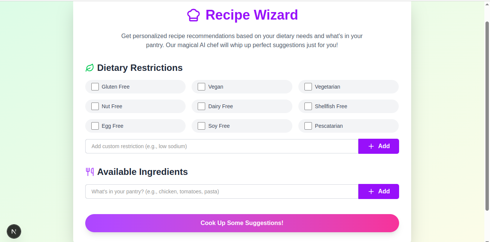
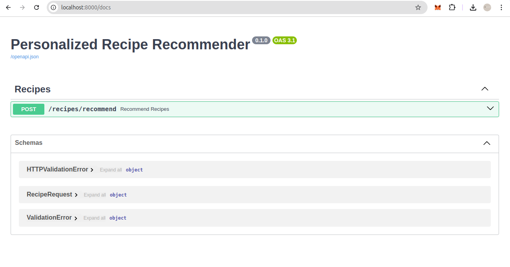

# Recipe Wizard - Your Personalized Recipe Finder

## Overview

Recipe Wizard is a web application designed to help you discover recipes tailored to your specific dietary restrictions and available ingredients. It's like having a magical chef at your service, providing personalized recipe suggestions! The application is built using Next.js and utilizes a separate backend (not included in this README) to fetch recipe data.



**Key Features**

- **Dietary Restriction Selection:** Specify your dietary needs (e.g., gluten-free, vegan, vegetarian, nut-free) using a user-friendly interface.
- **Custom Dietary Restrictions:** Add any dietary restrictions that are not included in the common defaults.
- **Ingredient Input:** List the ingredients you have on hand to get recipes that you can actually make.
- **Recipe Recommendations:** Receive a list of recipe suggestions that match your dietary restrictions and available ingredients.
- **Recipe Details:** View detailed information for each recipe, including ingredients, instructions, and substitution tips.

## Tech Stack

- **Frontend Framework:** [Next.js](https://nextjs.org/)
- **UI Library:** Tailwind CSS
- **State Management:** React useState
- **Icon Library:** Lucide React

## Screenshots

Here's a glimpse of the Recipe Wizard interface:

## How to Run the Frontend

1.  **Prerequisites:**

- [Node.js](https://nodejs.org/) (Recommended version: >=18)
- [npm](https://www.npmjs.com/) (Usually comes with Node.js)

2.  **Clone the repository:**

_(Assuming you have the frontend code in a git repository)_

```bash
git clone <your_frontend_repository_url>
cd recipe-wizard # Or the name of your frontend directory
```

3.  **Install dependencies:**

```bash
npm install
```

4.  **Run the development server:**

```bash
npm run dev
```

5.  **Open your browser:**

- The application will be running at [http://localhost:3000](http://localhost:3000). Open this URL in your web browser.

## Backend Setup

_IMPORTANT: This frontend application requires a separate backend server to function correctly. The frontend makes API requests to fetch recipe data._



- The backend server is not included in this repository.
- Ensure the backend server is running and accessible at `http://localhost:8000`. (This is the default API endpoint used by the frontend.)
- The backend should be set up to receive POST requests at the `/recipes/recommend` endpoint.
- The backend should accept a JSON payload with `dietary_restrictions` (an array or null) and `available_ingredients` (an array or null).
- The backend should return a JSON response containing an array of recipes, where each recipe object has the following structure:

  ```json
  {
    "recipe_name": "Recipe Name",
    "description": "Recipe Description",
    "ingredients": ["Ingredient 1", "Ingredient 2", ...],
    "instructions": "Step-by-step instructions...",
    "substitutions_and_tips": "Tips for substitutions or variations..."
  }
  ```

## Next.js Information

This project was bootstrapped with [`create-next-app`](https://nextjs.org/docs/app/api-reference/cli/create-next-app).

To learn more about Next.js, take a look at the following resources:

- [Next.js Documentation](https://nextjs.org/docs) - learn about Next.js features and API.
- [Learn Next.js](https://nextjs.org/learn) - an interactive Next.js tutorial.
- [The Next.js GitHub repository](https://github.com/vercel/next.js) - your feedback and contributions are welcome!

## Deploy on Vercel

The easiest way to deploy your Next.js app is to use the [Vercel Platform](https://vercel.com/new?utm_medium=default-template&filter=next.js&utm_source=create-next-app&utm_campaign=create-next-app-readme) from the creators of Next.js.

Check out our [Next.js deployment documentation](https://nextjs.org/docs/app/building-your-application/deploying) for more details.
